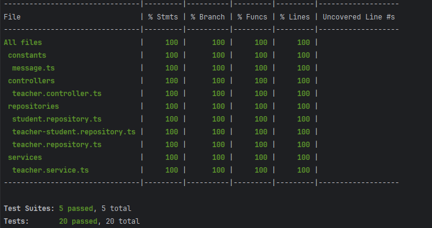
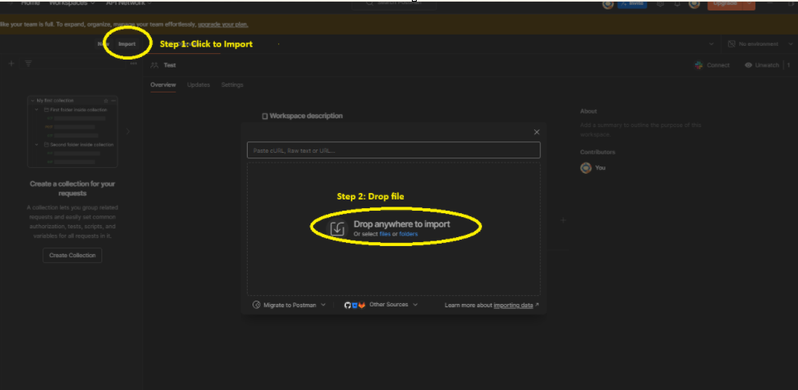
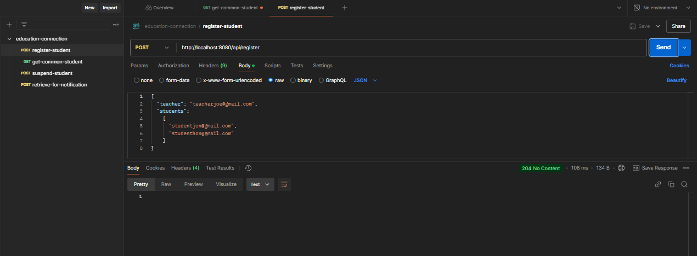

# Education Connection Backend

## Overview
Education connection is a backend service designed to help teachers perform administrative functions for their students. It's built using the NestJS framework, offering robust API endpoints for clients.

## Table Of Content
- [Overview](#overview)
- [Table Of Content](#table-of-content)
- [Approach](#approach)
  - [Technologies](#technologies)
  - [Generate source structure](#generate-source-structure)
  - [Choose a development method](#choose-a-development-method)
  - [Develop APIs and unit test](#develop-apis-and-unit-test)
  - [More ideas](#more-ideas)
- [Tech stacks](#tech-stacks)
- [Source structure](#source-structure)
- [Test coverage](#test-coverage)
- [How to run](#how-to-run)
  - [Pre-requisites](#pre-requisites)
  - [Installation](#installation)
  - [Environment setup](#environment-setup)
  - [Run docker compose](#run-docker-compose)
  - [Seeding](#seeding)
- [Development](#development)
- [Production](#production)
- [How to test](#how-to-test)
  - [Import Postman collection](#import-postman-collection)
  - [Call the first api](#call-the-first-api)
- [Note](#note)
- [Contact](#contact)

## Features
- Teacher can register students.
- Teacher can retrieve a list of students common to a given list of teachers.
- Teacher can suspend a specified student.
- Teacher can retrieve a list of students who can receive a given notification.

## Approach
### Technologies
- Choose a library or framework to develop APIs. 
- There are many options for this such as ExpressJS, NestJS, etc.

### Generate source structure
- Depend on requirement or project scope, choose a template or structure for this project.
- There are many options such as 3-layers architecture, module architecture, etc.

### Choose a development method
- Think about TDD (Test-driven development) or TLD (Test-Last development).

### Develop APIs and unit test
- Following the requirements, develop APIs to implement features.
- Write unit test to verify apis.

### More ideas
- Implement security with authentication, authorization.
- Tracing with log.
- Deploy app.

## Tech stacks
- **Backend Framework**: NestJS
- **Database**: MySQL with TypeORM
- **Testing**: Jest
- **Code Formatting and Linting**: ESLint, Prettier


## Source structure
```tree
...
├── src
│   ├── config
│   ├── constants
│   ├── controllers
│   │   ├── tests
│   │   │   ├── teacher.controller.spec.ts
│   │   ├── teacher.controller.ts
│   ├── database
│   │   ├── migrations
│   │   ├── seeding
│   ├── decorators
│   │   ├── validator
│   ├── dtos
│   │   ├── request
│   │   ├── response
│   ├── entities
│   │   ├── teacher.entity.ts
│   ├── filters
│   │   ├── http-exception.filter.ts
│   ├── modules
│   │   ├── teacher.module.ts
│   ├── pipes
│   │   ├── validation.pipe.ts
│   ├── repositories
│   │   ├── tests
│   │   │   ├── teacher.repository.spec.ts
│   │   ├── teacher.repository.ts
│   ├── services
│   │   ├── tests
│   │   │   ├── teacher.service.ts
│   ├── utils
│   ├── app.module.ts
│   ├── main.ts
```

## Test coverage



## How to run
### Pre-requisites
- Node.js v18.19.0
- Docker
- Postman

### Installation
To install the project, follow these steps:

```bash
git clone https://github.com/huynhquanhht/education-connection
cd education-connection
```

### Environment setup

To run this project, you will need to set up the following environment variables. You can do this by creating a `.env` file in folder `education-connection`.
```plaintext
# MySQL Database
#===
MYSQL_PORT_EXPOSE=3307
MYSQL_ROOT_PASSWORD=Root@123
MYSQL_USER=admin
MYSQL_PASSWORD=Admin@123
MYSQL_DATABASE=education_connection

# Server
#===
SERVER_PORT=8080
DB_HOST_MYSQL=mysql-db
DB_PORT_MYSQL=3306
DB_USERNAME_MYSQL=admin
DB_PASSWORD_MYSQL=Admin@123
DB_NAME_MYSQL=education_connection
DB_LOGGING=DISABLED
```

### Run docker compose
At folder `education-connection`, to build, start and run services:
```bash
docker-compose up
```

### Seeding

After the server is successfully up and running, you can proceed with running the seeding process.
```
docker exec -it education-connection-api npm run seed:run
```

## Development
### Database Migrations
To run migrations:
```bash
npm run migration:run
```

### Seeding
To run for seeding:
```bash
npm run seed:run
```
### Start application
```bash
npm run start
```

### Run test
To run tests:
```bash
npm run test
```

### Running and checking coverage
```bash
npm run test:cov
```

## Production
### Build application
```bash
npm run build
```
## How to test
### Import Postman collection
Import the content of [Postman File](./education-connection.postman_collection.json) to Postman following guide.



### Call the first api
Call the first api to get response.


## Note
- Following the requirement, I didn't create the API for registering a specific teacher or a specific student. Please run the seeding first to generate data. 
- Attach the postman file: [Postman File](./education-connection.postman_collection.json)

## 📜 License
This project is licensed under the MIT License - see the [LICENSE](./LICENSE) file for details.

## Contact
- Email: huynhquanhht@gmail.com
- Github: huynhquanhht